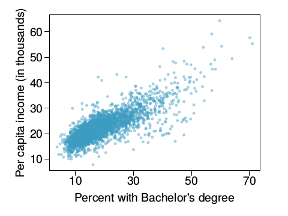

<!-- This syntax can be used to add comments that are ignored during knitting process. -->

##### Collaborators: Manjiri Kharkar


##### Setup: #####

In this problem set you will need, at minimum, the following R packages.

```{r Setup, message=FALSE}
# Load standard libraries
library(tidyverse)
```

#### Problem 1: Flight Delays  ####

Flight delays are often linked to weather conditions. How does weather impact flights from NYC? Utilize both the `flights` and `weather` datasets from the `nycflights13` package to explore this question. Include at least two visualizations to aid in communicating what you find.
                    

```{r P1-Load, message=FALSE}
# Load standard libraries and data
library(data.table)
library(nycflights13)
data(flights)
data(weather)
```
              
**Answer - **  
           
First we will join the two datasets based on 'origin' and 'time_hour'.  
```{r P1-Join, message=FALSE}
# This will create a new combined dataset 'flightweather'. 
flightweather <- inner_join(flights, weather,
                 by=c("origin" = "origin", "time_hour" = "time_hour"))
```

A quick review of data shows that the data has been successfully joined. There is no need to convert timezones.  

Filter out the flights with zero arrival delay. 

```{r P1-Filter, message=FALSE}
# This will filter remove records with zero arrival delay.  
flightweather <- flightweather %>%
                 filter(arr_delay!=0)
```
     
Next we will plot following two visualizations.    

1. Scatter plot of arrival delay vs temperature, colored by visibility.    

```{r P1-Viz1, message=FALSE}
# Scatter plot of arrival delay vs temperature, colored by visibility.  
ggplot(flightweather, aes(arr_delay, temp, color=visib))  + geom_point(size=0.05)
```
    
**Discussion of results - **       
As seen in the plot, no specific relation between visibility, temperature and arrival delay is found. Generally one would think that low winter temperatures, probably accompanied 
by snow would cause more delay. But that relationship cannot be found. Also, effect of visibility on arrival delay is not conclusive.    
    
2. Jitter plot of arrival delay vs wind speed, colored by visibility. 

```{r P1-Viz2, message=FALSE}
# Jitter plot of arrival delay vs wind speed, colored by visibility. 
# Y axis limit is set to between 0 and 50 mph wind speed. There were few unreasonable
# records with wind speed more than 1000 mph. We know those are invalid. 
ggplot(flightweather, aes(arr_delay, wind_speed, color=visib))  + geom_jitter(size=0.05) + ylim(0,50)
```
** Discussion of results - **        
As can be seen, higher wind speeds are associated with lower incidents of flight delay. A relationship can be seen that as wind speed increases, the possibility of a flight getting delayed decreases. So if a passanger wants to minimize the possibility of delay, they can travel on windy days and based on the visualization, their flight is more
likely to reach on time.    

#### Problem 2: 50 States in the USA ####

In this problem we will use the `state` dataset, available as part of the R statistical computing platforms. This data is related to the 50 states of the United States of America. Load the data and use it to answer the following questions.

```{r P2-Load, message=FALSE}
# Load the dataset 'state'. 
data(state)
head(state.x77)
```
    
##### (a) Describe the data and each variable it contains. Tidy the data, preparing it for a data analysis. 
     
**Answer - **    
We will work with dataset 'state.x77'. This is an atomic vector dataset with 50 rows and 8 columns, indicating various attributes of the 50 US states.     

Sources of data - 
U.S. Department of Commerce, Bureau of the Census (1977) Statistical Abstract of the United States.
U.S. Department of Commerce, Bureau of the Census (1977) County and City Data Book.

This dataset contains following variables -    

Population: Population estimate as of July 1, 1975.   

Income: per capita income in year 1974.      

Illiteracy: Illiteracy in 1970 expressed as percent of population.        

Life Exp: Life expectancy in years (1969-71).       

Murder: Murder and non-negligent manslaughter rate per 100,000 population in 1976.     

HS Grad: Percent of high-school graduates in 1970.    

Frost: Mean number of days with minimum temperature below freezing (1931-1960) in the state capital or a large city.      

Area: Land area of the state in square miles. 

There are other dataset vectors in the 'state' dataset. They are explained as follows - 

state.abb: Character vector of 2-letter abbreviations for the state names.   

state.area: Numeric vector of state areas (in square miles).    

state.center: List with components named x and y giving the approximate geographic center of each state in negative longitude and latitude. Alaska and Hawaii are placed just off the West Coast.     

state.division: Factor giving state divisions (New England, Middle Atlantic, South Atlantic, East South Central, West South Central, East North Central, West North Central, Mountain, and Pacific).    

state.name: Character vector giving the full state names.   

state.region: Factor giving the region (Northeast, South, North Central, West) that each state belongs to. 

**Tidy data -    **       
state.x77 is an atomic vector. For ease of analysis, this needs to be converted to a data frame.

Add 'state name' as a column. 

The population field seems to be incorrect. The current number needs to be multiplied by 1000 to get the correct figure.

Following R code will perform these above 3 functions.    

```{r P2-Tidy, message=FALSE}
# Convert data to data.frame 
state.x77 <- data.frame(state.x77)
#Add state name as new column
state.x77$state.name <- state.name
# Multiply population by 1000. 
state.x77 <- state.x77 %>% 
             mutate (Population = Population*1000)
```


##### (b) Suppose you want to explore the relationship between a state's `HS Grad` rate and other characteristics of the state, for example income, illiteracy rate, and more. Begin by examine the bivariate relationships present in the data. What does your analysis suggest might be important varibles to consider in building a model to explain variation in highschool graduation rates?
         
**Answer - **    
We will begin with a very simple scatter plot. 
```{r P2b-Plot1, message=FALSE}
# scatter plot of HS Grad vs Income
ggplot(state.x77, aes(HS.Grad, Income))  + geom_point()
# best fitting line plot of HS Grad vs Income. 
ggplot(state.x77, aes(HS.Grad, Income))  + geom_smooth(method=lm)
```
Both above visualizations indicate a positive relationship between percentage of HS Grad and income level. More the number of HS Grad, more the income. So income is definitely a variable to be included in any model analyzing HS Grad rates.     
    
Also, Illiteracy can be a factor to consider in such analysis. We will plot two similar plots like above - 

```{r P2b-Plot2, message=FALSE}
# scatter plot of HS Grad vs Illiteracy
ggplot(state.x77, aes(HS.Grad, Illiteracy))  + geom_point()
# best fitting line plot of HS Grad vs Illiteracy.  
ggplot(state.x77, aes(HS.Grad, Illiteracy))  + geom_smooth(method=lm)
```
Both visualizations indicate that Illiteracy percentage goes down as HS Grad percentage goes up. This indicates that HS grads also create a positive influence in their states reducing overall Illiteracy in the state. 

##### (c) Develop a new research question of your own that you can address using the `state` dataset. Clearly state the question you are going to address. Provide at least one visualization to support your exploration of this question. Discuss what you find.    
     
**Answer - **   
We will discuss following research question -    
**How are Murder rate and Illiteracy related? Is there a conclusive relationship that can be established?**    
    
We will begin with similar two plots plotted like above. 

```{r P2c-Plot1, message=FALSE}
# scatter plot of Illiteracy vs Murder rate.  
ggplot(state.x77, aes(Illiteracy, Murder))  + geom_point()
# best fitting line plot of Illiteracy vs Murder rate.  
ggplot(state.x77, aes(Illiteracy, Murder))  + geom_smooth(method=lm)
```
Very clearly there exists a trend between Illiteracy and Murder. As Illiteracy goes up, the murder rate in that state goes up. This also leads to a finding that more education means less crime in society. If similar ployts were plotted with Murder rate and HS Grad, it would indicate that as number of HS Grad go up, the murder rate goes down. 

#### Problem 3: Income and Education ####

The scatterplot below shows the relationship between per capita
income (in thousands of dollars) and percent of population with a bachelor's degree in 3,143
counties in the US in 2010.

##### (a) What are the explanatory and response variables?     
     
**Answer - **    
Here the explanatory variable is plotted on X axis, which is 'Percent with Bachelor's Degree'. This is explanatory variable since it is an independent variable and is not affected by another variable. The variable plotted on Y-axis, 'Per Capita income' is a response variable, since it is affected by the variable 'Percent with Bachelor's Degree'.   

##### (b) Describe the relationship between the two variables. Make sure to discuss unusual observations, if any.   
    
**Answer - **    

There are a large number of observations between 10 to 30 percent of percent with Bachelor's degree. In general, we can see a trend that in counties with more percentage with bachelor's degree, the per capita income is higher. As the percentage of bachelor's degree holder increases, per capita income increases.   
     
There are a few outliers, above $30,000 and $40,000 income lines for relatively low percentage of bachelor's degree holders. It means that in some counties with percentage of bachelor's degree holders at about 10% to 20%, the per capita income is more than $30K and $40K, which are comparable to counties with much higher percentage of bachelor's degree holders. These are unusual observations. Also there are few outliers on opposite end of this anamoly. Some counties with higher percentage of bachelor's degrees have less per capita income. But all hese outliers are very few in numbers.      

##### (c) Can we conclude that having a bachelor's degree increases one's income? Why or why not?    
    
**Answer - **   
   
Though the relationship indicates that that having a bachelor's degree increases one's income, we cannot definitely say that it is a true statement.    

The reason is this is a relationship between percentage of bachelor's degree holders in a county and per capita income. Per capita income calculations also include people who don't work, family members, students etc. There is no direct relationship established between a specific person's degree and that person's income. The only thing that could be established is that counties with more percentage of bachelor's degree holder tend to be affluent in general. 

Also, there could be variety of other factors that affect a county's per capita income. To name a few - Tourism, seasonal activities, average family size, average age of county residents etc.   
   
Thus we can conclude that though having a bachelor's degree may help a person earn higher income, however, no conclusive relationship can be established based on the data that is given.    



